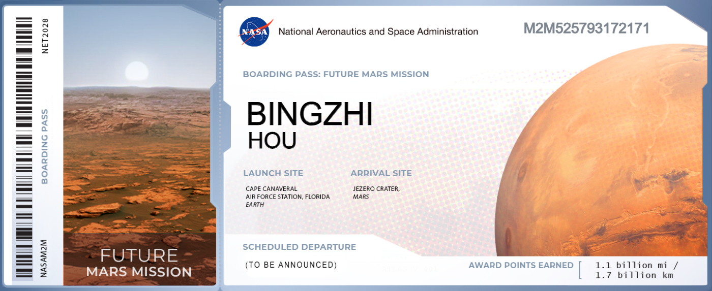

# About Me

谈不上走了很多的路，吃了很多的苦，但是还是想要把我的故事记录下来，提醒自己，回头看看路，不要忘了16岁自己的梦想，继续向前走，虚心请教的同时，也不要忘了关注自己的内心。

**博学而笃志，切问而近思。**

最近在找日常实习的时候，有个面试官问了一个问题，我为什么选择了计算机，又为什么选择了Java后端？我的职业规划是怎样的？

# Rewind

中学时代，我一直都是个很热血的人，初中立志要上我们当地最好的高中，有多励志呢？借着一次上台发言的机会，我拿着话筒大声告诉台下所有的师生我的梦想，以至于在其他教学楼上课的学生都听到了。这是我第一次告诉大家我的梦想。

**那个颤抖得几乎都要哭出来却又很坚定的声音和一往无前的气势，作为一个瘦弱的女生，我现在回想起来都感到无比的震撼和感动。** 大家都知道我的梦想，哪怕很简单，就是上本地最好的高中，但是都会有意无意、时不时地帮助我，我最后真的上了那所高中，作为一个天资愚笨的学生，离不开长期的努力，也离不开那天"发疯般"地触动心灵地大喊。大家都知道了我的梦想和决心，我也知道了自己的愿望有多强烈。

当我大声说出梦想的时候，全世界都在给我让路。

这是我初中印象最深刻的一刻，让我知道了梦想的力量，学会了追逐梦想。真正和我现在的职业规划搭上关系，要从高中二年级开始。

## 未来的工程师开始启航

高中二年级时，有一件令我印象很深刻，也令我很愤怒的事，就是"孟晚舟事件"，加拿大非法拘禁华为创始人任正非的女儿，实际上是美国对华为的制裁和警告。从高中二年级一直到报考专业，我的目标就是立志进入中国的科技行业，我要做中国自己的芯片，打败美国，我要学信息与通信工程这样的专业。同样也是，一提到我的梦想，我就两眼发光，一点都不惧怕跟别人说出我的这个看起来"假大空"的梦想。

虽然高考成绩自己并不满意，对物理也并不擅长，但是我还是选择了自动化专业。被录取这个专业后，一直到第一学期，我都通过知乎、家长、老师等等渠道了解这个专业的就业方向，也去学院的实验室开始尝试焊电路板，一直不断地探索。虽然后来发现，即使对芯片很热爱，也觉得对社会有很深远的意义，但我对物理是真的不擅长，甚至有点儿痛苦，但是我喜欢程序世界。既然底层电路这些我做不来，那就试试软件嘛。

## 我不确定，但我想试试

虽然我也并不确定我转到软件方向，就一定能做好，但我想试试，**至少我确定了我不擅长硬件，为什么不向其他领域探索呢，如果我能在其他领域做出对这个世界有积极意义的产品，不也一样很好吗?**

事实是，我真的做到了！

这就是我转入计算机专业的原因，因为我想探索出自己擅长的、对社会有积极意义的、自己热爱的。虽然一开始学C语言的时候确实很痛苦，但是看到它运行起来的那一刻，觉得很满足，觉得自己好像找到和自己灵魂相通的方向了一样，虽然不是那么容易，但是自己确实是能够做好的，无非是一遍两遍三遍四遍不停地去看、去思考为什么、去模仿、去自己造而已。

我为什么选择了Java，很简单。一是Java的学习路线很友好，能够很快给人以正反馈，这也许也是让我觉得自己热爱的原因之一，二是Java也确实很流行，很多公司都有Java相关的岗位，让我觉得我真的能用Java做出对社会有积极意义的产品，三，其实选择什么语言没那么重要，Java或许不会永远流行，就像PHP一样，社会和公司的业务是不断变化的，要做好转语言的准备，**一个优秀的工程师也不应该不看具体业务场景去死抠一门语言**，做出好的产品，要思考，也要应该重视底层原理，原理学好了，语言之间的转换也不难。

如果时间可以倒流，我会回到中学时代，对自己说，你好，谢谢你的梦想，支撑着我前进，大家都说你努力，很多人也夸你优秀，我也觉得你超级优秀😉虽然这一路走得并不顺利，也有很多次迷茫，觉得自己被否定，但是一切都在向好的方向发展，20岁的我没有让你失望，也没有忘记我们的梦想👍你我各自努力，最高处见！！！

# 我的火星船票

NASA 星球科学总监 Jim Green 表示，把自己姓名发送到火星上，也是参与火星以及未来太空探险旅行的一种方式。

