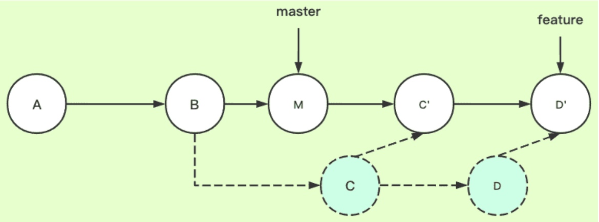

# Git的rebase

如果此时有两个分支，一个master分支，一个feature分支（需求开发分支），feature是从master的某个节点处分离出来的一条分支。

如果我们在feature分支开发一段时间后，想拉取master分支的最新代码合并到feature上，可以用git pull --rebase。feature是待变基分支，master是基分支。

比如说feature是master节点B处拉出来的一条新分支，在feature分支开发一段时间后（此时是A->B->C->D），要拉取master最新的代码合到feature上（比如master分支上在B节点后新开发了M）。这时候需要把feature上的提交暂存下来，然后删掉feature的提交记录，找到master的最新记录，再把暂存的feature提交接上去。

所以显而易见，使用git pull --rebase，会使feature的原基底都变了，会丢掉一部分之前的提交记录，有时候不好追溯之前的提交。