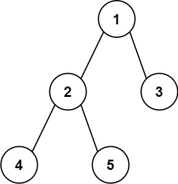

# 3.二叉树的直径

## 题目

给你一棵二叉树的根节点，返回该树的最大直径。

二叉树的直径是指两个节点之间的最大距离，不一定经过根节点。比如下面这颗树：



```
输入：[1,2,3,4,5]
输出：3
解释：取路径[4,2,1,3]或者[5,2,1,3]的长度
```
## 思路

找到最大直径，其实就是维护一个最大值，这个最大值是，所有的``节点的左子树和右子树之和``中的最大值。因为二叉树本身就是一个递归的结构，所以我们可以递归遍历二叉树的每一个节点。

那最大值怎么维护？

如果当前节点的左右子树不为空，左右路径的大小即``上一个节点的左右路径大小加一``。

上一个节点的左右路径大小怎么保存下来？

遍历每一个节点时候，保存最大值时，同时返回当前节点的最大路径即可。

## 代码

```java
class TreeNode{
  int val;
  TreeNode left;
  TreeNode right;
  TreeNode(){}
  TreeNode(int val){
    this.val = val;
  }
  TreeNode(int val,TreeNode left,TreeNode right){
    this.val = val;
    this.left = left;
    this.right = right;
  }
}

class Solution{
  int max = 0;
  public int findMaxSize(TreeNode root){
    if(root == null){
      return 0;
    }
    dfs(root);
    return max;
  }

  private int dfs(TreeNode root){
    if(root.left == null && root.right == null){
      return 0;
    }
    int leftSize = root.left == null ? 0 : dfs(root.left) + 1;
    int rightSize = root.right == null ? 0 : dfs(root.right) + 1;
    max = Math.max(max,leftSize + rightSize);
    return Math.max(leftSize,rightSize);
  }
}
```
