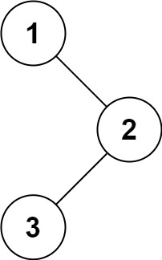

# 12.二叉树的前序遍历

给你二叉树的根节点 root ，返回它节点值的 前序 遍历。



```
输入：root = [1,null,2,3]
输出：[1,2,3]
```

## 思路

用递归法很简单，用迭代法怎么实现？

如果是层序遍历，一层一层遍历，适合用队列，刚好满足先进先出，先上层，后下层的顺序。

如果是前中后序遍历，适合用栈来模拟。收集结果的时候，要注意收集结果的时机。在向栈中push元素的时候，要先push右子树，再push左子树，因为队列是先进后出，为了符合前序遍历的顺序。

```java
class TreeNode{
    int val;
    TreeNode left;
    TreeNode right;
    TreeNode(){}
    TreeNode(int val){
        this.val = val;
    }
    TreeNode(int val,TreeNode left,TreeNode right){
        this.val = val;
        this.left = left;
        this.right = right;
    }
}
class Solution{
    public List<Integer> preorderTraversal(TreeNode root){
        List<Integer> res = new ArrayList<>();
        if(root == null){
            return res;
        }
        Stack<TreeNode> stack = new Stack<>();
        stack.push(root);
        while(!stack.isEmpty()){
            // 返回栈顶元素并出栈
            TreeNode node = stack.pop();
            res.add(node.val);
            if(node.right != null){
                stack.push(node.right);
            }
            if(node.left != null){
                stack.push(node.left);
            }
        }
        return res;
    }
}
```