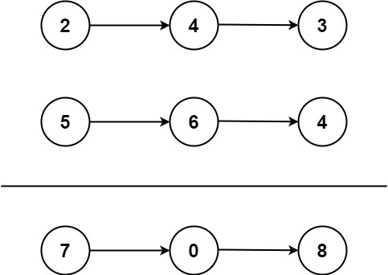

# 6.两数相加

给你两个 非空 的链表，表示两个非负的整数。它们每位数字都是按照 逆序 的方式存储的，并且每个节点只能存储 一位 数字。

请你将两个数相加，并以相同形式返回一个表示和的链表。

你可以假设除了数字 0 之外，这两个数都不会以 0 开头。



```
输入：l1 = [2,4,3], l2 = [5,6,4]
输出：[7,0,8]
解释：342 + 465 = 807.
```

# 思路

我们观察发现，输入链表l1和l2逆序存储数字，最后输出链表存储的数字也是逆序的，如果单看链表存储的话，发现进位也是逆序的，即进位不是向左进位，而是向右进位。可以维护一个int类型的变量index，用来处理进位。

```java
class ListNode{
    ListNode next;
    int val;
    ListNode(){}
    ListNode(int val){
        this.val = val;
    }
    ListNode(int val,ListNode next){
        this.val = val;
        this.next = next;
    }
}

class Solution{
    public ListNode addTwoNums(ListNode l1,ListNode l2){
        // 使用虚拟头结点是为了方便处理第一个节点
        ListNode dummy = new ListNode();
        // 因为要有输出链表，所以定义一个cur，后面会将下一个节点拼到cur节点的后面
        ListNode cur = dummy;
        int index = 0;
        // 如果index不为0，说明下一个节点需要处理进位
        while(index != 0 || l1 != null || l2 != null){
            // 终止条件是l1所在节点为null，即走完链表
            if(l1 != null){
                index += l1.val;
            }
            if(l2 != null){
                index += l2.val;
            }
            cur = cur.next = new ListNode(index % 10);
            index /= 10;
            if(l1 != null){
                l1 = l1.next;
            }
            if(l2 != null){
                l2 = l2.next;
            }
        }
        return dummy.next;
    }
}

```