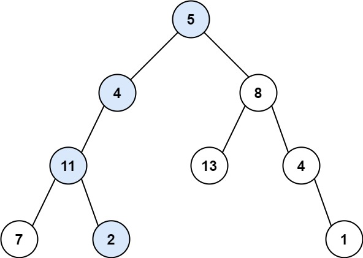

# 7.路径总和

给你二叉树的根节点 root 和一个表示目标和的整数 targetSum 。判断该树中是否存在 根节点到叶子节点 的路径，这条路径上所有节点值相加等于目标和 targetSum 。如果存在，返回 true ；否则，返回 false 。

叶子节点 是指没有子节点的节点。



```
输入：root = [5,4,8,11,null,13,4,7,2,null,null,null,1], targetSum = 22
输出：true
解释：等于目标和的根节点到叶节点路径如上图所示。
```
## 思路

要求**根节点到叶子节点**这条路径上的节点之和，等于目标和，所以需要判断当前的节点是否是根节点。每遍历一个节点，目标和就减去节点的值，遍历到根节点时，判断这个计数器是否为0。

```java
public class TreeNode{
    int val;
    TreeNode left;
    TreeNode right;
    TreeNode(){}
    TreeNode(int val){
        this.val = val;
    }
    TreeNode(int val,TreeNode left,TreeNode right){
        this.val = val;
        this.left = left;
        this.right = right;
    }
}

public class Solution{
    // 这个函数隐含着回溯的细节，因为是把targetSum作为参数整体传进去的
    // 函数结束后，targetSum的值并没有改变
    public boolean hasPathSum(TreeNode root,int targetSum){
        if(root == null){
            return false;
        }
        targetSum -= root.val;
        if(root.left == null && root.right == null){
            return targetSum == 0;
        }

        if(root.left != null){
            if(hasPathSum(root.left,targetSum)){
                return true;
            }
        }
        if(root.right != null){
            if(hasPathSum(root.right,targetSum)){
                return true;
            }
        }
        return false;
    }
}
```