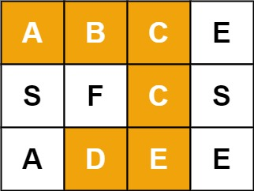

# 10.单词搜索

给定一个 m x n 二维字符网格 board 和一个字符串单词 word 。如果 word 存在于网格中，返回 true ；否则，返回 false 。

单词必须按照字母顺序，通过相邻的单元格内的字母构成，其中“相邻”单元格是那些水平相邻或垂直相邻的单元格。同一个单元格内的字母不允许被重复使用。



```java
输入：board = [["A","B","C","E"],["S","F","C","S"],["A","D","E","E"]], word = "ABCCED"
输出：true
```

## 思路

题目要求有两点需要注意的，一是字母不允许被重复使用，所以可以定义一个boolean类型的数组，来标记二维数组中的某个元素是否被访问过。二是最后返回是否找到这个单词，可以定义一个boolean类型的数值来标记是否找到。

搜索方式可以使用深度优先搜索，一直搜，直到到头或者不满足条件再回溯，使用我们定义的boolean类型的数组来标记某个元素被访问过，回溯后，因为选择其他位置再次寻找，要再标记成未访问。

```java
class Solution{
    boolean find = false;
    public boolean exist(char[][] board,String word){
        if(board == null || word == null){
            return false;
        }
        int m = board.length;
        int n = board[0].length;
        boolean visited[][] = new boolean[m][n];
        for(int i = 0;i < m;i++){
            for(int j = 0;j < n;j++){
                dfs(i,j,board,visited,word,0);
            }
        }
        return find;
    }

    void dfs(int i,int j,char[][] board,boolean[][]visited,String word,int pos){
        if(i < 0 || i >= board.length || j < 0 || j >= board[0].length || find || visited[i][j] || board[i][j] != word.charAt(pos)){
            return;
        }
        if(pos == word.length()-1){
            find = true;
            return;
        }
        visited[i][j] = true;
        dfs(i+1,j,board,visited,word,pos+1);
        dfs(i-1,j,board,visited,word,pos+1);
        dfs(i,j+1,board,visited,word,pos+1);
        dfs(i,j-1,board,visited,word,pos+1);
        visited[i][j] = false;
    }
}
```